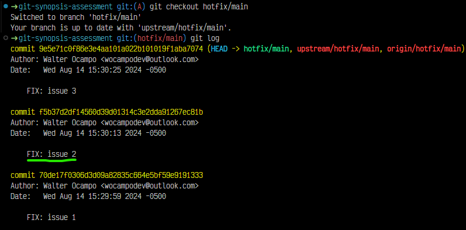
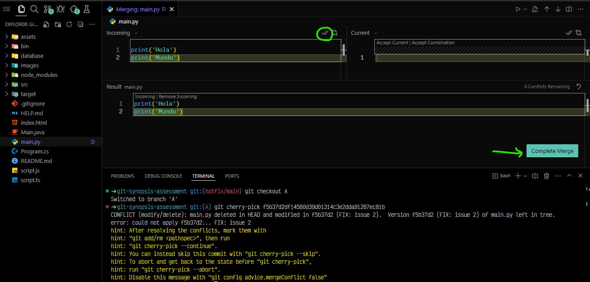
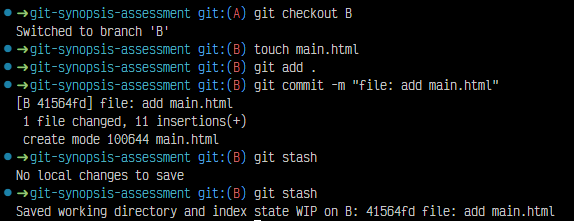
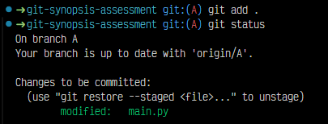
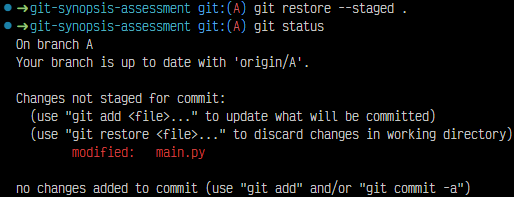
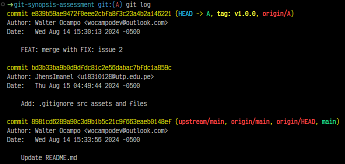
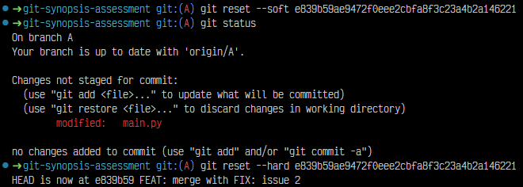

# Solución

## Actividad 1 - Genere una nueva rama A en base a main y agregar los ficheros que considere necesarios. (.js | .ts | .java | .cs | .html | etc)

1. Me aseguro de estar el rama **main** y luego creo un nueva rama llamada A con **git checkout -b A**.

    

2. Genero los ficheros con touch y verifico.

    
    

## Actividad 2 - Restringir del historial de cambios a las carpetas /bin /node_modules y /target

1. Genero un fichero .gitignore e ingreso con nano para cambiar su contenido desde la terminal.

    

2. Introduzco las /carpetas, guardo con ctrl+O y salgo con ctrl+X + Y, luego me aseguro que este creado.

    
    

## Actividad 3 - Generar 2 carpetas cualquiera sin contenido que sean incluidas en el historial de cambios

1. Creo dos carpetas con mkdir, con touch creo los ficheros .gitkeep respetando su ubicación y con git status me aseguro que sean visibles en el historial.

    

## Actividad 4 - Generar otra rama B para realizar nuevas modificaciones y luego integrar estos en la rama A

1. Creo la rama B, luego creo un carpeta con mkdir y guardo los cambios con un commit.

    
    
    

3. Me ubico en la rama A y hago merge para traer los cambios de la rama B con **git merge B**.

    
    

## Actividad 5 - Integrar SOLO el commit con nombre "FIX: issue 2" de la rama hotfix/main en la rama A

1. Me ubico en la rama hotfix/main, luego uso **git log** para ver la id del commit llamado FIX: issue 2.

    

2. Luego me ubico en la rama A, uso el comando **git cherry-pick {ID}** y trato de solucionar cualquier conflicto haciendo merge.

    

## Actividad 6 - Ejemplifique el uso de git para la modificación de ficheros en la rama A y en la rama B simultaneamente sin generar commits en el historial de cambios

1. Me ubico en la rama A y uso **git stash**, lo mismo en para la rama B pero siempre con previos cambios.

    
    

2. Se utiliza **git stash pop** para recuperar el stash, luego tener la opcion de aceptar y vizualizar los ficheros afectados.

    

## Actividad 7 - Ejemplifique el uso de git para la generación y publicación de un nuevo release (versión) de su código

1. Para agregarle un tag se utiliza el comando **git tag -a v1.0.0 -m {message}** y para enviarlo al repositorio remoto se usa **git push --tags origin**.

    

## Extra 1 - Ejemplique el uso de git para devolver un fichero del staging area al estado anterior

1. Con **git add .** me aseguro que se agreguen todos al **Staging Area**, con **git status"** visualizar la lista que esperan ser confirmados.

    

2. Con **git restore --staged** se puede recuperar el contenido del Staging Area.

    

## Extra 2 - Ejemplifique el uso de git para regresar en el tiempo hacia un commit anterior en la rama A de su repositorio remoto propio

1. Para retornar a un commit anterior, primero se debe conoder su ID con git log.

    

2. El comando que hace realidad esta accion es **git reset --soft {ID}** que es útil para mantener cambios ya que no afecta el staging area ni el working directory, como tambien esta **git reset --hard {ID}** que es útil para descartar todos los cambios no commitados.

    
